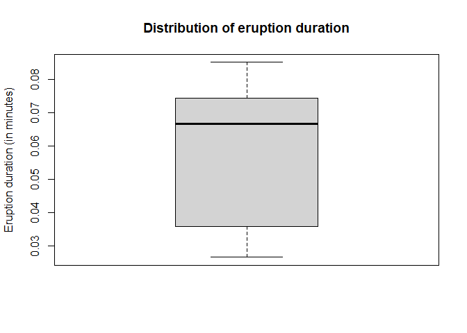

HW 1 - Key
================
SDS348 Spring 2021

## Enter your name and EID here

**This homework is due on Feb 1, 2021 at 8am. Submit a pdf file on
Gradescope.**

*For all questions, include the R commands/functions that you used to
find your answer (show R chunk). Answers without supporting code will
not receive credit. Write full sentences to describe your findings.*

### Question 1: (2 pts)

##### The dataset `faithful` contains information about eruptions of the Old Faithful geyser in Yellowstone National Park. The first few observations are listed below.

``` r
head(faithful)
```

    ##   eruptions waiting
    ## 1     3.600      79
    ## 2     1.800      54
    ## 3     3.333      74
    ## 4     2.283      62
    ## 5     4.533      85
    ## 6     2.883      55

##### How many observations are there of each variable (i.e., how many rows are there)? What exactly do these variables measure? *Use a command to get information about the dataset.*

``` r
# information about the size of the dataset: 
# any of these lines is correct (answer is 272 observations and 2 variables)
str(faithful)
```

    ## 'data.frame':    272 obs. of  2 variables:
    ##  $ eruptions: num  3.6 1.8 3.33 2.28 4.53 ...
    ##  $ waiting  : num  79 54 74 62 85 55 88 85 51 85 ...

``` r
nrow(faithful)
```

    ## [1] 272

``` r
length(faithful)
```

    ## [1] 2

``` r
dim(faithful)
```

    ## [1] 272   2

``` r
# information about the variables:
# either using ? or help()
```

There are 272 observations and 2 variables. The variable `waiting` is
waiting time between eruptions in minutes and the variable `eruptions`
is duration of an eruption in minutes.  
**-1pt if no code**  
**-1pt if no sentence**

------------------------------------------------------------------------

### Question 2: (7 pts)

##### 2.1 (5 pts) What are the minimum, maximum, mean, and median values for each variable? Write sentences to describe these values. Note that there are many functions that can be used to answer this question.

``` r
# Many ways to find these values (could be done individually or using summary)
summary(faithful$eruptions)
```

    ##    Min. 1st Qu.  Median    Mean 3rd Qu.    Max. 
    ##   1.600   2.163   4.000   3.488   4.454   5.100

``` r
summary(faithful$waiting)
```

    ##    Min. 1st Qu.  Median    Mean 3rd Qu.    Max. 
    ##    43.0    58.0    76.0    70.9    82.0    96.0

The minimum eruption duration is 1.6 minutes while the maximum eruption
duration is 5.1 minutes. The mean eruption duration is 3.49 minutes and
the median eruption duration is 4 minutes.  
The minimum waiting time is 43 minutes while the maximum waiting time is
96 minutes. The mean wating time is 70.9 minutes and the median waiting
time is 76 minutes.  
**-0.5pt per missing measure**  
**-3pt if no code**  
**-2pt if no sentence**  
**-1pt if no unit**

##### 2.2 (2 pts) Create a table (using - and \|) to display the statistics calculated previously for each variable.

Create a summary table directly in text (not in r code chunk - it’s
possible but can be challenging).

| measure | eruption duration (minutes) | waiting time (minutes) |
|---------|-----------------------------|------------------------|
| minimum | 1.6                         | 43                     |
| mean    | 3.5                         | 70.9                   |
| median  | 4.0                         | 76.0                   |
| maximum | 5.1                         | 96.0                   |

**-0pt be consistent while reporting decimals**  
**-2pt if no table**  
**-0.5pt if no unit**

------------------------------------------------------------------------

### Question 3: (6 pts)

##### Recall how logical indexing of a dataframe works in R. To refresh your memory, in the example code below I ask R for the number of rows in the dataset where the variable `waiting` takes on values greater than 60. Then I ask for the average of the variable `eruptions` when the variable `waiting` is above 60.

``` r
nrow(faithful[faithful$waiting>60,])
```

    ## [1] 189

``` r
mean(faithful[faithful$waiting>60,]$eruptions)
```

    ## [1] 4.138587

##### 3.1 (1 pt) What is the comma doing in the code above (i.e., why is it necessary)?

The comma separates row and column indicies.  
**-1pt if no mention of rows and columns, or dimensions**

##### 3.2 (1 pt) What is the standard deviation of the variable `eruptions`?

``` r
sd(faithful$eruptions)
```

    ## [1] 1.141371

The eruption time typically varies by 1.14 minutes from the mean.  
**-0.5pt if no code**  
**-0.5pt if no sentence**

##### 3.3 (2 pts) What is the mean of the variable `eruptions` when `waiting` is *less than* 1 hour?

``` r
# can either convert 1 hour in 60 minutes or convert the variable eruptions in hours
mean(faithful[faithful$waiting<60,]$eruptions)
```

    ## [1] 1.998273

The mean eruption duration is about 2.0 minutes when the waiting time is
less than 1 hour.  
**-1pt if no code or wrong**  
**-0.5pt if minor error in the code**  
**-1pt if no sentence**

##### 3.4 (2 pts) What is the standard deviation of the variable `eruptions` when `waiting` is *greater than* the median?

``` r
# can either include median into indexing or using the value of the median
sd(faithful[faithful$waiting>median(faithful$waiting),]$eruptions)
```

    ## [1] 0.3730518

The eruption time typically varies by .37 minutes from the mean when the
waiting time is above the median.  
**-1pt if no code or wrong**  
**-0.5pt if minor error in the code**  
**-1pt if no sentence**

------------------------------------------------------------------------

### Question 4: (3 pts)

##### Both variables are measured in minutes. Create two new variables named `eruptions_h` and `waiting_h` that give each variable **in hours rather than minutes** and add them to the dataset `faithful`. To help get you started, I have given you code that creates both variables but fills them with `NA` values. Replace `NA` below with code that computes the requested transformation. Print out the first few rows of the updated dataset using `head()`.

``` r
# creating new variables and adding them to the dataset faithful
faithful$eruptions_h <- faithful$eruptions/60
faithful$waiting_h <- faithful$waiting/60

# print the first few rows
head(faithful)
```

    ##   eruptions waiting eruptions_h waiting_h
    ## 1     3.600      79     0.06000 1.3166667
    ## 2     1.800      54     0.03000 0.9000000
    ## 3     3.333      74     0.05555 1.2333333
    ## 4     2.283      62     0.03805 1.0333333
    ## 5     4.533      85     0.07555 1.4166667
    ## 6     2.883      55     0.04805 0.9166667

**-2pt if no code or wrong**  
**-1pt if created variables but did not add them to the faithful
dataset**  
**-1pt if no print of first few rows to check what happened**

### Question 5: (7 pts)

##### Let’s make some plots in base R.

##### 5.1 (2 pts) Create a boxplot of each variable using the `boxplot()` function and describe the distribution of each variable (e.g., use the words symmetric, skewed, the center is around \_, …). Make sure to label axes and give a title to the graph.

``` r
# fine if using base R plot or ggplot2
# fine if using variables in hours but not both
boxplot(faithful$eruptions,
        main="Distribution of eruption duration", 
        ylab="Eruption duration (in minutes)")
```



The distribution of the eruption duration is negatively skewed. Half of
the eruption durations are greater than 4 minutes and vary roughly
between 2.0 and 4.5 minutes.

``` r
# fine if using base R plot or ggplot2
# fine if using variables in hours but not both
boxplot(faithful$waiting,
        main="Distribution of waiting time", 
        ylab="Waiting time (in minutes)")
```


The distribution of the waiting time is negatively skewed. Half of the
waiting times are greater than 76 minutes and vary roughly between 60
and 80 minutes.  
**-0.5pt if no title or label**  
**-1pt if no plot / incorrect**  
**-1pt if no sentence** **-0.5pt if missing mention of shape, center, or
spread**  
**-0.5pt if including variables in hours: displaying the same
distribution, just different scale**

##### 5.2 (2 pts) Create a histogram of each variable using the `hist()` function and describe the distribution of each variable (e.g., use the words symmetric, skewed, the center is around \_, …). Make sure to label axes and give a title to the graph.

``` r
# fine if using base R plot or ggplot2
# fine if using variables in hours but not both
hist(faithful$eruptions,
        main="Distribution of eruption duration", 
        xlab="Eruption duration (in minutes)")
```


The distribution of the eruption duration is bimodal with a peak between
1.5 to 2 minutes and another peak at 4 to 4.5 minutes.

``` r
# fine if using base R plot or ggplot2
# fine if using variables in hours but not both
hist(faithful$waiting,
        main="Distribution of waiting time", 
        xlab="Waiting time (in minutes)")
```


The distribution of the waiting time is bimodal with a peak between 50
to 55 minutes and another peak at 75 to 85 minutes.  
**-0.5pt if no title or label**  
**-1pt if no plot / incorrect**  
**-1pt if no sentence** **-0.5pt if missing mention of shape, center, or
spread**  
**-0.5pt if including variables in hours: displaying the same
distribution, just different scale**

##### 5.3 (1 pt) Create a scatterplot by plotting both variables against each other using the `plot()` function. Make sure to label axes and give a title to the graph.

``` r
# fine if using base R plot or ggplot2
# fine if using variables in hours but not both
plot(faithful$eruptions,faithful$waiting,
     main="Relationship between eruption duration and waiting time", 
        xlab="Eruption duration (in minutes)", ylab="Waiting time (in minutes)")
```


**-0.5pt if no title or label**  
**-1pt if no plot / incorrect**

##### 5.4 (2 pts) What can you see from the scatterplot that you cannot see from the histograms? What can you see from the histogram that you cannot see from the boxplots?

The histograms show the distribution of one variable at a time, while
the scatterplot shows the variables simultaneously and thus the
relationship. The histograms show that both eruptions and waiting have a
bimodal distribution, a fact which cannot be seen from the boxplots.  
**-1pt if no mention of relationship/asssociation**  
**-1pt if no mention of bimodal/skew**
